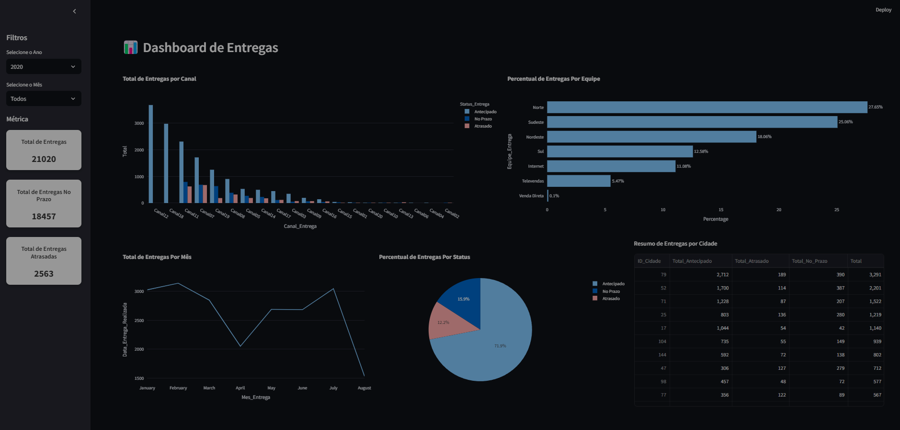

# Logistics Dashboard 📦

This project is a **Logistics Dashboard** built using **Streamlit**, **Pandas**, and **Plotly**. It provides insights into delivery performance, including metrics like total deliveries, on-time deliveries, delayed deliveries, and various visualizations to assist in logistics analysis. 



[Link](https://logisticsdashboard-s9azdejg3ai43dp7eawyzz.streamlit.app/)
---

## 📋 Features

- **Interactive Filters**:
  - Filter data by year and month.
  
- **Metrics Display**:
  - Total Deliveries
  - Total On-Time Deliveries
  - Total Delayed Deliveries

- **Visualizations**:
  - Deliveries by Channel
  - Delivery Percentage by Team
  - Monthly Delivery Trends
  - Delivery Status Breakdown
  - City-wise Delivery Summary Table

---

## 🛠️ Technologies Used

- **Backend**:
  - Python
  - Pandas
- **Frontend**:
  - Streamlit
  - Plotly (for visualizations)
- **Data**:
  - Input data is processed from Excel files.
  - Cleaned and saved as CSV for optimized performance.

---

## 📂 Project Structure

```plaintext
.
├── Logistics.py         # Main dashboard logic and layout
├── calculate.py         # Functions for calculating metrics and summaries
├── clean_data.py        # Data cleaning and preprocessing
├── utils.py             # Utility functions and style configurations
├── data/
│   ├── dataset.xlsx     # Raw dataset (input)
│   ├── processed_dataset.csv # Processed dataset (output)
└── README.md            # Project documentation
  
